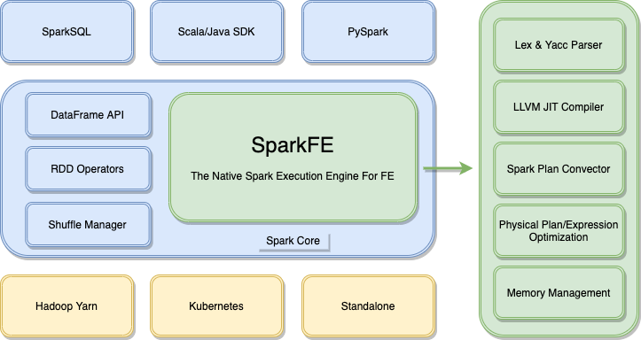

## 简介

SparkFE是针对AI特征工程场景的基于LLVM优化的高性能Spark原生执行引擎。

## 背景

为什么需要SparkFE？

* Spark性能优化已经达到瓶颈，基于C++和LLVM开发原生执行引擎可以更好地利用CPU和GPU等硬件加速，实现数倍的性能提升。
* Spark专注成为通用的离线计算框架，对机器学习的特征抽取方法和特征上线支持不足，SparkFE能够弥补Spark的缺陷在AI场景更好地落地。
* 对比其他原生执行引擎，如Intel OAP和Nvidia spark-rapids等，SparkFE重写SQL优化和基于LLVM即时编译代码，在性能和灵活性上都有更好的表现。

SparkFE受众是谁？

* Spark用户，SparkFE兼容大部分SparkSQL语法，只要是Spark用户都可以使用SparkFE加速，并且不需要修改应用代码。
* Spark开发者，熟悉Spark源码或LLVM JIT的开发者，都可以参与SparkFE开源项目，实现更多Spark的性能加速和功能拓展。
* 使用Spark做机器学习的用户，SparkFE提供针对AI场景的语法拓展和高性能特征抽取实现，能够解决离线特征上线时的一致性问题。

SparkFE为什么快？

* SparkFE基于C++和LLVM开发，能针对不同硬件平台进行编译优化和二进制码生成，底层重写了SQL编译器和表达式优化过程，对Spark不支持CodeGen的物理节点也在SparkFE中高效实现了，并且创新地在Spark上实现了多窗口并行计算以及窗口数据倾斜优化等特性，还有实现更高效的内存管理来避免JVM垃圾回收带来的性能开销。

SparkFE有什么特点？

* **高性能**

    基于LLVM优化，在相同硬件下部分场景性能比Spark快6倍以上，同一个应用的运行时间更短且TCO成本更低。
    
* **零迁移成本**

    Scala、Java、Python或R语言实现的SparkSQL应用，不需要修改源码和重新编译，替换SPARK_HOME即可享受原生执行引擎加速。
    
* **针对机器学习优化**
  
    提供机器学习场景常用的特殊拼表操作以及定制化UDF/UDAF支持，基本满足生产环境下机器学习场景特征工程的研发需求。

* **离线在线一致性**
  
    结合[FEDB](https://github.com/4paradigm/fedb)，使用SparkFE开发的机器学习应用支持一键上线，保证离线在线一致性，大大降低机器学习场景的落地成本。

* **Upstream同步** 
  
    兼容Spark 3.0及后续版本，保证Spark基础功能与社区上游同步，特殊场景也可以回退使用Spark本身的优化。
