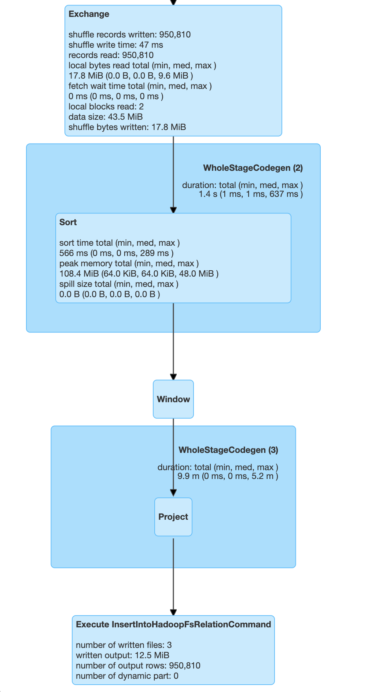
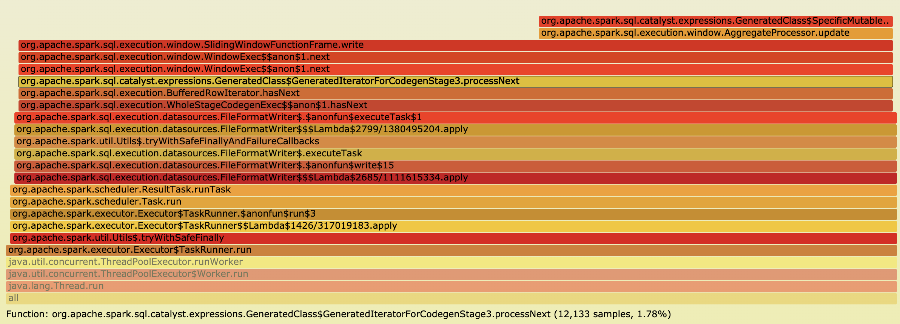
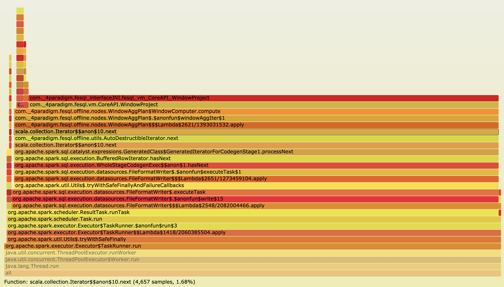

# NativeWindow优化

## 介绍

SparkFE面向AI和FE场景进行优化，尤其在支持时序窗口的特征抽取上，无论是功能还是性能都比标准Spark有很大提升。

## Spark Over Window实现

对于Spark包含了Catalyst模块，用于进行SQL解析以及最终的RDD物理计划的生成。一个包含时间窗口的SQL用例如下。

```
select 
    col1,
    sum(col2) over w as sum_col2,
    max(col2) over w as max_col2,
    min(col2) over w as min_col2,
    avg(col2) over w as avg_col2
from t1
window w as (partition by col1 order by col2 ROWS BETWEEN 10000 PRECEDING AND CURRENT ROW)
```

根据语意，Spark需要对`col1`列进行分区，所以的滑窗计算都是在每个分区内进行，对应的RDD操作为`repartition`。然后根据用户脚本，分区内的数据要以`col2`进行排序，排序后保留一个10000个数据的窗口缓冲区，对应的RDD操作为`sortWithinPartitions`。最终排序后的数据依次进入窗口缓冲区，根据窗口边界定义检查是否需要滑出，每滑入一行进行一组聚合计算输出一行结果。

标准Spark使用RDD支持的结果，可以很高效地实现前面分区和排序的功能，但对于窗口滑动计算部分，目前是使用Scala语言进行实现的。虽然Spark 2.0开始了Tungsten模块对部分算子进行了Whole-stage code generation的优化，但从最终生成的物理计划可以看出，Window节点是没有被优化的，代码中也缺少对codegen接口的实现。



实际上窗口的滑出判断以及窗口缓冲区聚合计算是计算密集型操作，使用Scala实现并不高效，而且没有codegen支持相当于缺少了更底层的编译器优化。因此虽然SparkSQL有了对ANSI SQL的Window支持，可以用来实现时序特征计算，但仍有巨大的提升空间。

## SparkFE优化实现

SparkFE是基于Spark的原生执行引擎，可以很好地优化前面提到的计算密集型代码逻辑。

根据SQL Window语意，SparkFE同样会使用RDD的`repartition`和`sortWithinPartitions`进行数据分区和排序，这样可以很好地利用Spark在分布式计算上的优化，而不需要重写网络通信等所有底层接口。在分区和排序后，滑窗逻辑和聚合计算都通过JNI调用SparkFE的native接口来实现。通过JIT技术，用户不需要提前在运行的物理环境进行预编译，而是由SparkFE提前对SQL进行编译优化，把所需要的聚合函数以及滑窗逻辑实时生成LLVM IR，基于LLVM的编译器和后端代码生成器来生成平台优化的二进制码。在计算密集型的窗口聚合计算上，使用LLVM JIT的生成的代码在效率上比用Scala实现的在JVM上运行的代码高很多，尤其加上向量化等优化可以达到数倍的性能提升。除了JIT上的优化，SparkFE内部基于C++还使用了更高效的队列数据结果和更好的堆对象回收机制，并且兼容Spark内部支持的UnsafeRow连续内存格式，大大降低跨语言调用的开销。

对包含Window计算的标准Spark应用进行火焰图性能分析，目前滑动窗口的开销占比就不小，而且窗口内部的聚合计算也不够高效。



同样对SparkFE进行火焰图性能分析，纯计算逻辑的时间占比更高，整体任务运行时间也更短。


